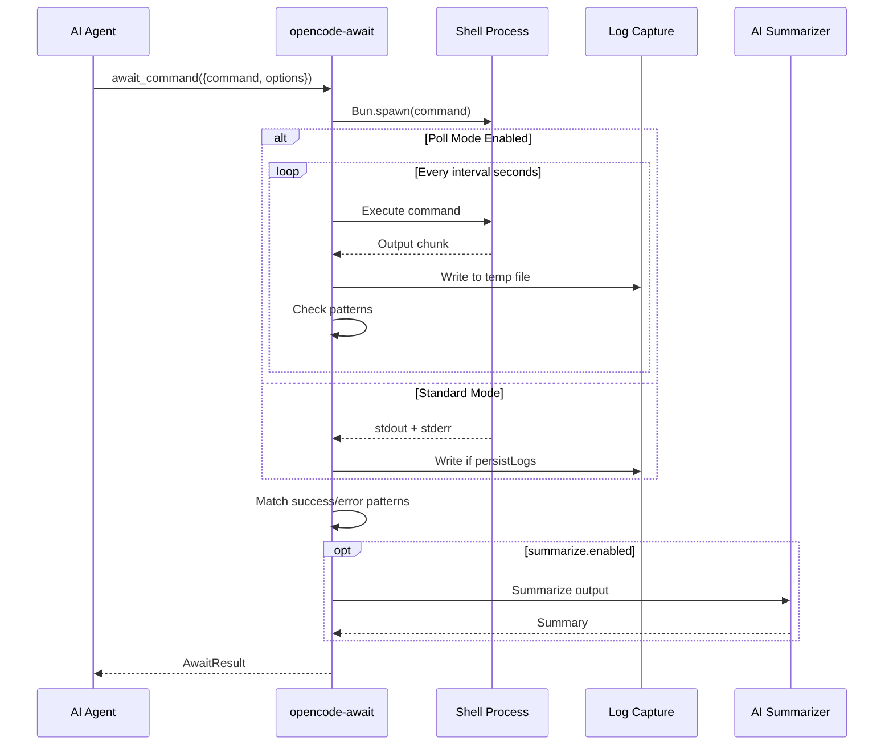

## Quick Start

Use the `await_command` tool to run and monitor long-running commands:

```typescript
await_command({
  command: "npm run build",
  maxDuration: 300,
  successPattern: "Build completed",
  errorPattern: "Error:|Failed"
})
```

## Basic Options

- `command`: The shell command to execute
- `maxDuration`: Maximum time in seconds (default: 300)
- `successPattern`: Regex to match for success
- `errorPattern`: Regex to match for failure

## How It Works

