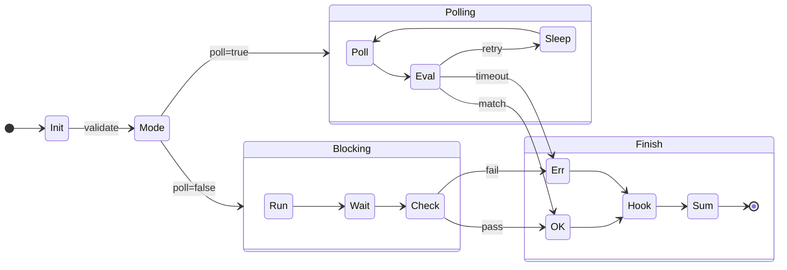

The `await_command` tool operates as a state machine that handles command execution, monitoring, and result processing. It supports two primary modes: **Blocking** (single execution) and **Polling** (repeated execution).

## State Machine Diagram

## Execution Flow

### 1. Initialization
The tool validates input arguments, checking for required fields and applying configuration defaults from `.opencode/await-config.json`.

### 2. Execution Mode

#### Blocking Mode
Used for commands that run once and finish (e.g., builds, tests).
- Spawns the process and waits for it to exit naturally.
- Checks exit code (default 0 = success).
- Scans output for `successPattern` or `errorPattern` if provided.

#### Polling Mode
Used for checking status repeatedly (e.g., `kubectl get pods`, `gh run watch`).
- Runs the command in a loop with a defined `pollInterval`.
- Accumulates output across attempts.
- Stops immediately if a pattern matches or timeout is reached.
- Also stops if the command completes successfully without a pattern match (new behavior).

### 3. Result Processing
- **Hooks**: Executes `onSuccess` or `onFailure` commands if defined.
- **Summarization**: If enabled, sends output to the AI model to generate a concise summary and extract keywords.
- **Log Persistence**: Saves full output to a temporary file (auto-cleaned after 30 mins).
- **Return**: Delivers a structured JSON response to the agent.
