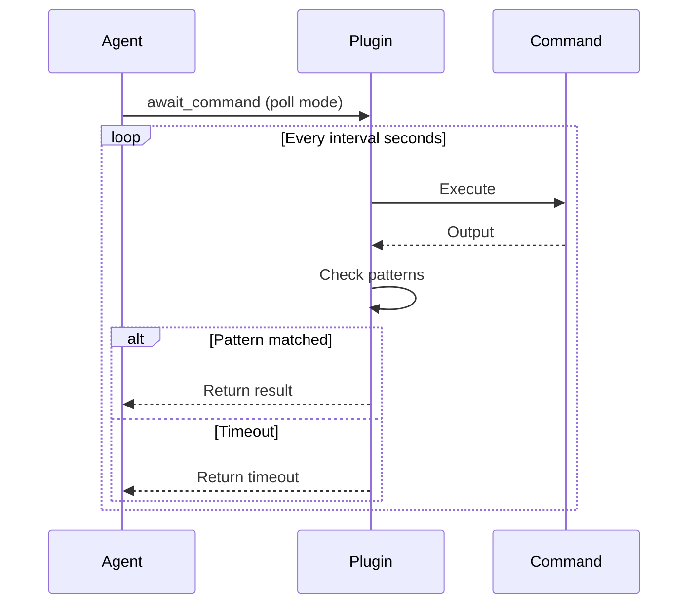

## Overview

Poll mode repeatedly executes a command at regular intervals until a pattern matches or the timeout is reached. This is useful for commands that need to be run multiple times to check status.

## Basic Poll Mode

Enable poll mode with the `pollMode` option:

```typescript
await_command({
  command: "kubectl get pods -o wide",
  maxDuration: 300,
  pollMode: {
    enabled: true,
    interval: 10  // Poll every 10 seconds
  },
  successPattern: "Running",
  errorPattern: "CrashLoopBackOff|Error"
})
```

## Options

| Option | Type | Default | Description |
|--------|------|---------|-------------|
| `enabled` | boolean | `false` | Enable poll mode |
| `interval` | number | `5` | Seconds between polls (1-60) |
| `appendOutput` | boolean | `true` | Append each poll's output (vs replace) |

## Use Cases

### Kubernetes Deployment Readiness

```typescript
await_command({
  command: "kubectl rollout status deployment/myapp",
  maxDuration: 300,
  pollMode: {
    enabled: true,
    interval: 5
  },
  successPattern: "successfully rolled out"
})
```

### Database Migration Status

```typescript
await_command({
  command: "rails db:migrate:status",
  maxDuration: 60,
  pollMode: {
    enabled: true,
    interval: 3
  },
  successPattern: "up.*all"
})
```

### Service Health Check

```typescript
await_command({
  command: "curl -s http://localhost:3000/health",
  maxDuration: 120,
  pollMode: {
    enabled: true,
    interval: 5
  },
  successPattern: '"status":"healthy"'
})
```

## Flow Diagram



## Comparison: Poll Mode vs Standard Mode

| Aspect | Standard Mode | Poll Mode |
|--------|--------------|-----------|
| Execution | Once | Repeated |
| Output | Single capture | Accumulated |
| Best for | Long-running commands | Status checks |
| Pattern check | At completion | After each poll |
